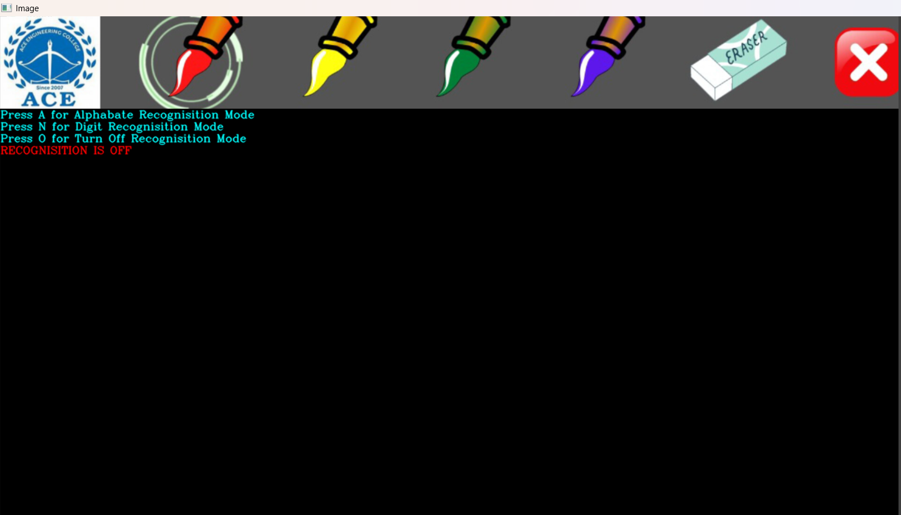
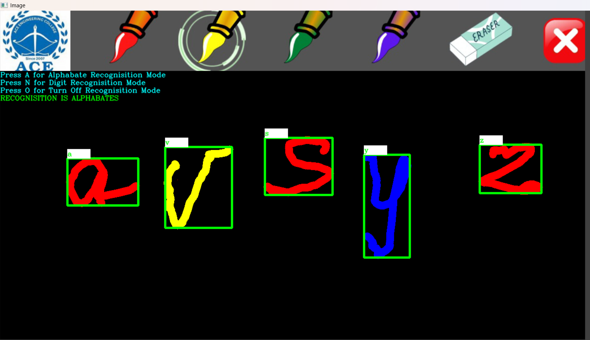
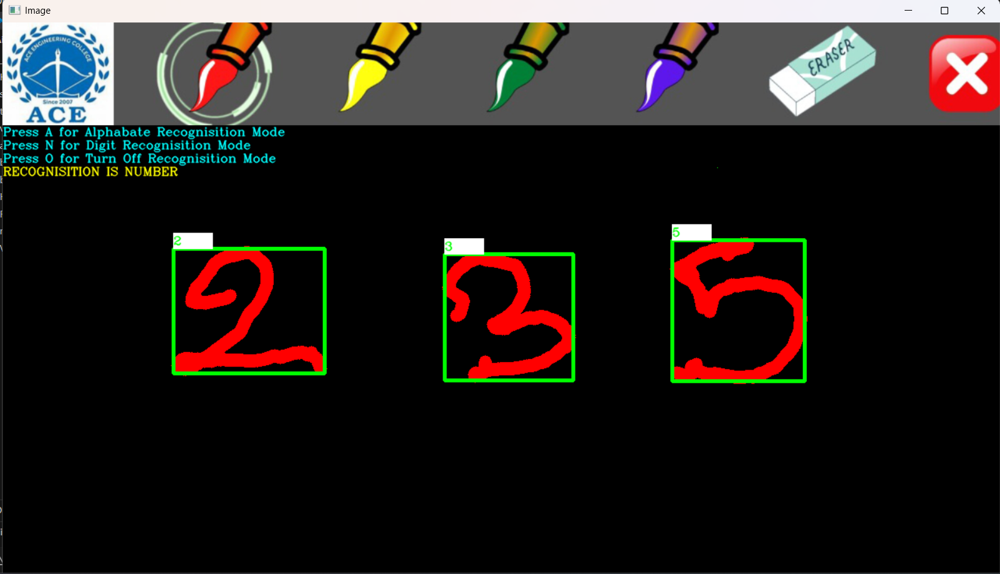

# ✋ Real-Time Air Writing and Alphanumeric Character Recognition

A real-time computer vision project that allows users to **write letters and numbers in the air using hand gestures**. The system tracks the hand movement through a webcam and recognizes the air-written characters using image processing and machine learning techniques.

## 🚀 Features

* ✋ Real-time hand tracking using a webcam
* 🖊️ Air-writing using finger movements
* 🔤 Recognition of alphabetic characters
* 🔢 Recognition of numeric characters
* 📷 Real-time video processing
* ⚡ Fast character prediction
* 🖥️ Interactive and easy-to-use interface

## 🛠️ Technologies Used

* **Python**
* **OpenCV**
* **MediaPipe**
* **TensorFlow / Keras**
* **NumPy**
* **Machine Learning**
* **Computer Vision**

## 📂 Project Structure

```text
Air-Writing-and-Character-Recognition/
│
├── main.py
├── requirements.txt
├── README.md
├── dataset/
├── models/
├── utils/
└── ...
```

> Note: The exact files and folders may vary depending on the project version.

## ⚙️ Installation

### 1. Clone the repository

```bash
git clone https://github.com/GBhavyasri19/Real-Time-Air-Writing-and-Alphanumeric-Character-Recognition-.git
```

### 2. Open the project folder

```bash
cd Real-Time-Air-Writing-and-Alphanumeric-Character-Recognition-
```

### 3. Create a virtual environment

```bash
python -m venv venv
```

### 4. Activate the virtual environment

**Windows:**

```bash
venv\Scripts\activate
```

### 5. Install dependencies

```bash
pip install -r requirements.txt
```

## ▶️ How to Run

Start the application using:

```bash
python main.py
```

Make sure your **webcam is connected and accessible** before running the project.

## 🧠 How It Works

The project follows these general steps:

1. The webcam captures live video.
2. MediaPipe detects and tracks the user's hand.
3. Finger movement is used to identify the air-writing path.
4. The captured writing is processed using image-processing techniques.
5. The trained machine-learning model analyzes the written character.
6. The predicted alphabet or number is displayed to the user.

## 📸 Screenshot folder

Air-Writing-and-Character-Recognition-main/
│
├── screenshots/
│   ├── plainboard.png
│   ├── alphabets.png
│   └── numbers.png
│
├── README.md
├── .gitignore
└── ...

## 📸 Screenshots

### ✍️ Air Writing Board



### 🔤 Alphabet Recognition



### 🔢 Number Recognition


## 🎯 Applications

* Human-computer interaction
* Touchless interfaces
* Educational applications
* Assistive technology
* Gesture-based systems
* Computer vision research

## 🔮 Future Improvements

* Improve recognition accuracy
* Support more complex characters
* Add word and sentence recognition
* Support multiple languages
* Improve real-time performance
* Develop a GUI/web-based interface
* Add voice output for recognized characters

## 👩‍💻 Author

**Gadagani Bhavyasri**

GitHub: [GBhavyasri19](https://github.com/GBhavyasri19)

## 📄 License

This project is intended for educational and research purposes.

